<!DOCTYPE html>
<html>
<head>
    <meta charset="UTF-8">
    Quantitative Analysis of single-molecule FISH (smFISH) Images
</head>
<body>

<h1>Quantitative Analysis of single-molecule FISH (smFISH) Images</h1>

<h2>Introduction</h2>

Single-molecule Fluorescent in situ Hybridization (smFISH) is a technique used to visualize and quantify individual mRNA molecules within single cells. It allows for a precise measurement of gene expression. This project aims to develop a pipeline to quantify the effects of two therapeutic compounds, JQ1 and TSA, on the expression of a target gene. The hypothesis is that such treatments will alter the transcriptional activity which can be measured by counting the number of mRNA spots per cell. To achieve this, a robust image analysis workflow is required to accurately segment cells and nuclei from noisy smFISH images and quantify the transcriptional output.

<h2>Pipeline Overview</h2>

  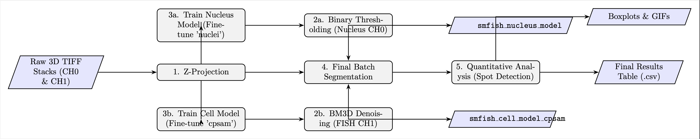

<h3>Data Preprocessing</h3>

The raw data consisted of 3D multi-channel TIFF stacks with a shape of <em>(Z, C, Y, X)</em>, where <em>Z = 15</em> slices and <em>C = 2</em> channels (smFISH signal and nuclear stain). To simplify the data for 2D analysis, a Python script was used to generate a 2D representation via a <strong>Maximum Intensity Projection</strong> along the Z-axis for all raw images.

Each TIFF was split into two projections creating separate output folders for each treatment condition (<code>DMSO</code>, <code>JQ1</code>, <code>TSA</code>):

<ul>
<li><strong>nucleus</strong>: channel 0, containing nuclear stain</li>
<li><strong>fish</strong>: channel 1, containing smFISH signal</li>
</ul>

<h3>Image Denoising</h3>

Because of the background noise in the smFISH channel, a denoising step was essential for successful segmentation. The <strong>BM3D (Block-matching and 3D filtering)</strong> algorithm was implemented to reduce background noise and enhance the signal-to-noise ratio of the smFISH images prior to model training and segmentation.

  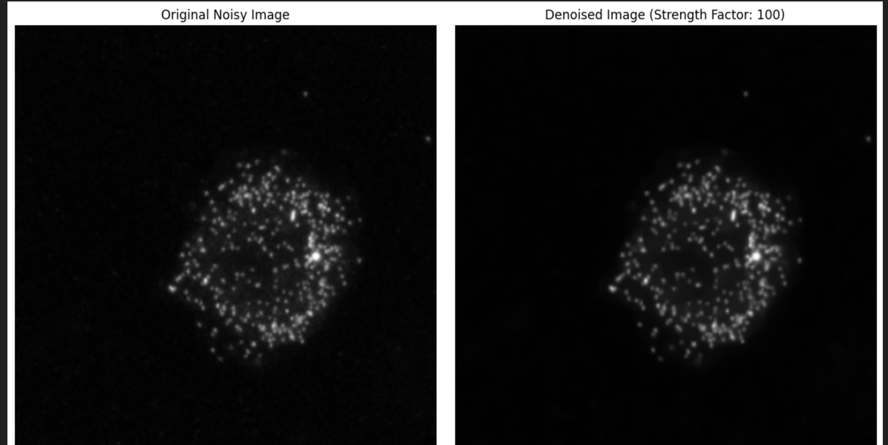

<h3>Cell and Nucleus Segmentation</h3>

Image segmentation was performed using the Cellpose library.

<strong>Cell (smFISH) Segmentation:</strong> The final, successful model was developed by fine-tuning the pre-trained <strong><code>cpsam</code></strong> model. The model was trained on the denoised smFISH images. Training was performed on a cloud computing platform with an RTX6000 Ada GPU. The following parameters were used:

<ul>
<li><code>n_epochs = 400</code></li>
<li><code>learning_rate = 0.005</code></li>
<li><code>batch_size = 4</code></li>
<li><code>weight_decay = 0.0001</code></li>
<li><code>min_train_masks = 1</code></li>
</ul>

<strong>Nucleus Segmentation:</strong> For the nucleus channel, the pre-trained <strong><code>nuclei</code></strong> model from Cellpose was used directly on the maximum intensity projection images. This strategy provided accurate masks without the need for fine-tuning on this specific dataset.

<h3>Quantification and Statistical Analysis</h3>

A blob detection script was ran on the complete dataset to identify and count mRNA spots within the boundaries of each segmented cell. The light intensity of the spots was also quantified to identify potential nascent transcription sites.
To determine whether the observed differences in mRNA counts between treatment groups were statistically significant, a <strong>Dunn's Post-Hoc Test</strong> was performed following a Kruskal-Wallis test.

<h2>Results</h2>

<h3>Model Development and Validation</h3>

The primary challenge of this project was developing a model that could accurately segment cells from the sparse and spotty smFISH signal.

My initial attempts at training a custom model by fine-tuning the pre-trained "cyto2" model resulted in a model that produced empty masks. The model was converging on the simplest solution and failing to learn any helpful patterns from the spotty images. I then decided to NOT change the model but to instead change the <strong>input images</strong> by transforming the cloudy/spotty channel 1 images into solid, filled-in blobs. This attempt turned out to be futile since it produced the same empty output.

  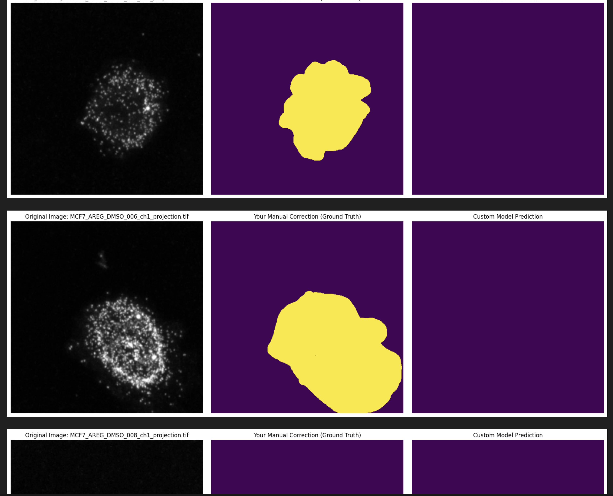

Subsequent strategies which included implementing a two-channel training approach, also yielded disappointing results. The turning point was the introduction of a denoising step. After applying the BM3D algorithm to the FISH images, I switched to fine-tuning another pre-trained model, <strong><code>cpsam</code></strong>. Validating this new model on the training dataset showed that <code>cpsam</code> + denoising was the winning strategy as it successfully reproduced, to some degree, the manually corrected ground-truth masks.

  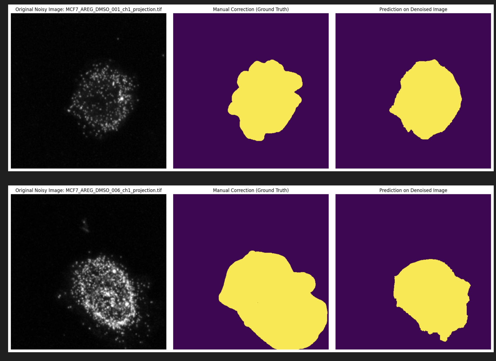

For the nucleus channel, manual inspection of the masks generated by the pre-trained <code>cyto2</code> model revealed they were already perfect, requiring no manual correction. While a fine-tuned model was trained for consistency, it did not perform as well as a simple, older pre-trained model, <strong><code>nuclei</code></strong>, which was ultimately used for the final analysis.

  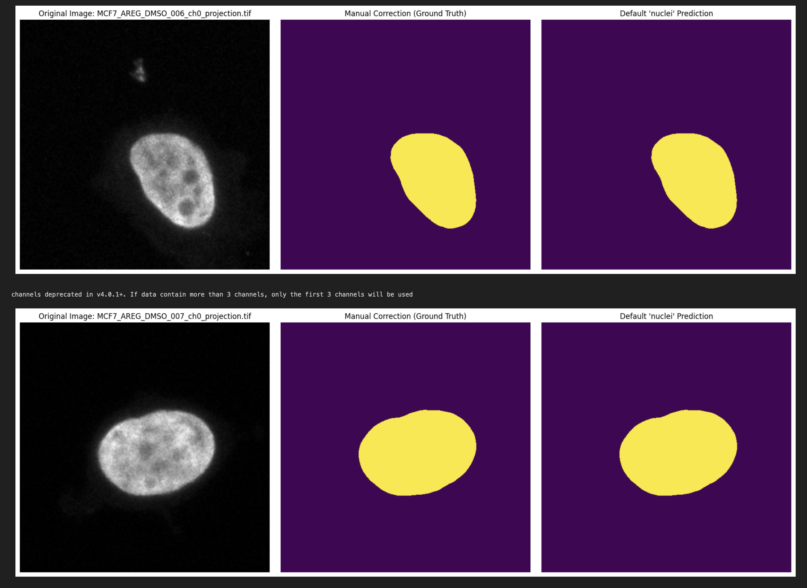

<h3>Generalization to Experimental Data</h3>

The final <code>cpsam</code>-based cell model and the <code>nuclei</code> model were applied to the complete processed dataset. The models generalized well to unseen images across all treatment conditions. Outlines from the predicted masks were compiled to generate animated .gif files for visualization.

  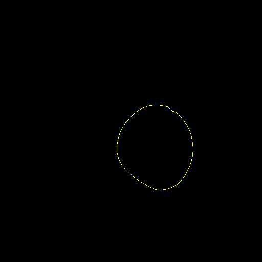
  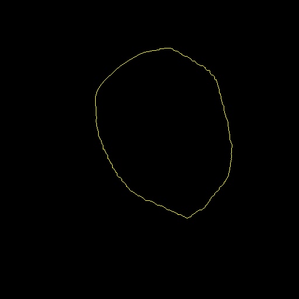

The final segmentation outlines were superimposed onto their respective original images to visually confirm the model's performance.

<table style="width:100%; border-collapse: collapse;">
  <thead>
    <tr>
      <th style="text-align: center; border: 1px solid #ddd; padding: 8px;">DMSO Condition</th>
      <th style="text-align: center; border: 1px solid #ddd; padding: 8px;">TSA Condition</th>
    </tr>
  </thead>
  <tbody>
    <tr>
      <td style="text-align: center; border: 1px solid #ddd; padding: 8px;">
        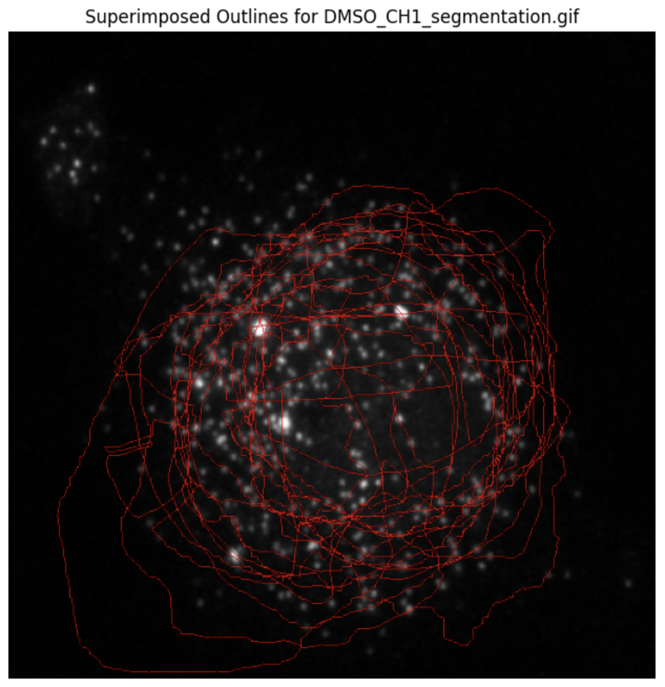
      </td>
      <td style="text-align: center; border: 1px solid #ddd; padding: 8px;">
        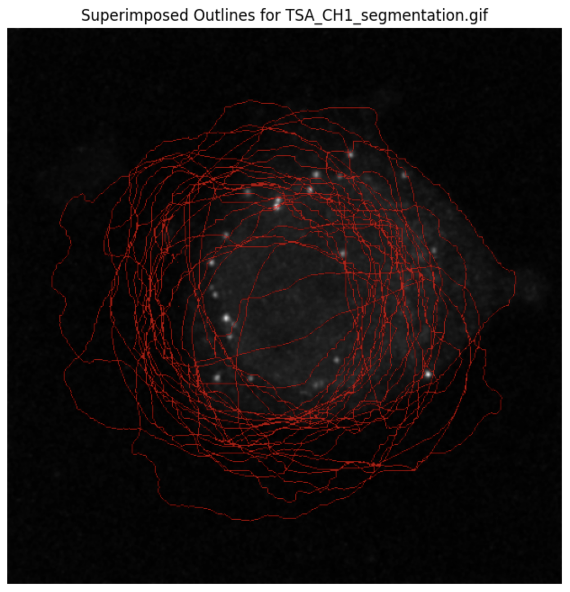
      </td>
    </tr>
    <tr>
      <td style="text-align: center; border: 1px solid #ddd; padding: 8px;">
        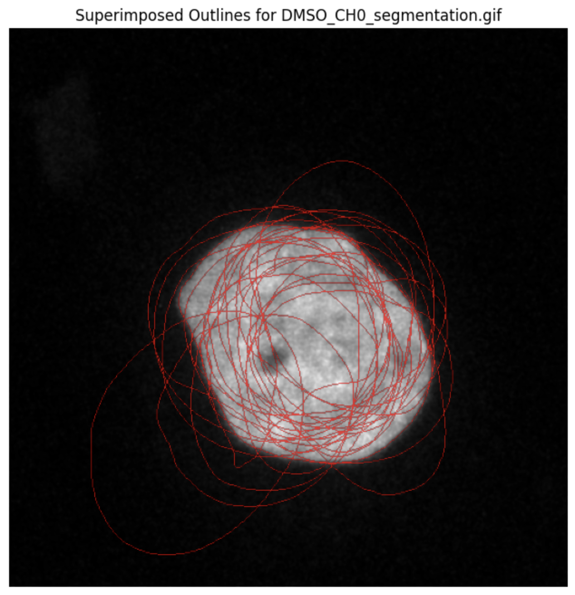
      </td>
      <td style="text-align: center; border: 1px solid #ddd; padding: 8px;">
        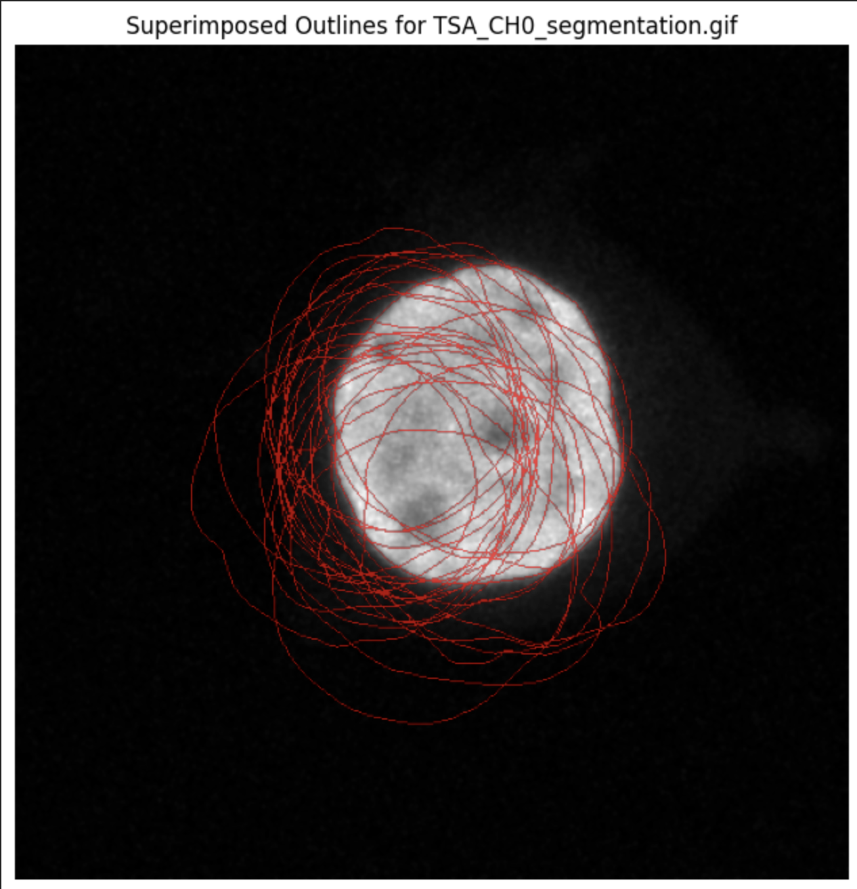
      </td>
    </tr>
  </tbody>
</table>

<h3>Quantification of mRNA Expression</h3>

Following segmentation, mRNA spots were counted in each cell for all treatment conditions. The results show that the median number of mRNA spots is highest in the DMSO (control) condition, lower in the JQ1 condition, and lowest in the TSA condition.

  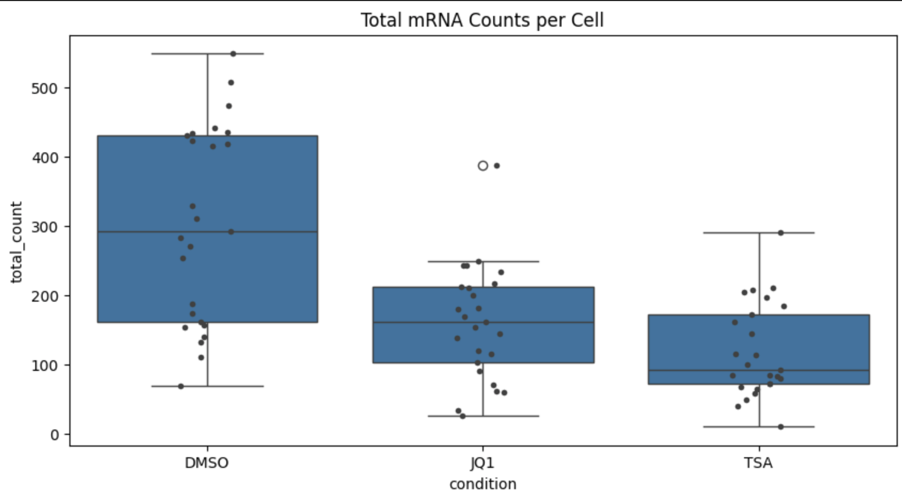

The statistical validation for this observation is provided by Dunn's post-hoc test.

<strong>Table 1: Dunn's Post-Hoc Test Results (p-values)</strong>

<table style="width:100%; border-collapse: collapse;">
  <thead>
    <tr>
      <th style="text-align: left; border: 1px solid #ddd; padding: 8px; background-color: #f2f2f2;"></th>
      <th style="text-align: left; border: 1px solid #ddd; padding: 8px; background-color: #f2f2f2;">DMSO</th>
      <th style="text-align: left; border: 1px solid #ddd; padding: 8px; background-color: #f2f2f2;">JQ1</th>
      <th style="text-align: left; border: 1px solid #ddd; padding: 8px; background-color: #f2f2f2;">TSA</th>
    </tr>
  </thead>
  <tbody>
    <tr>
      <td style="text-align: left; border: 1px solid #ddd; padding: 8px;"><strong>DMSO</strong></td>
      <td style="text-align: left; border: 1px solid #ddd; padding: 8px;">1.000000</td>
      <td style="text-align: left; border: 1px solid #ddd; padding: 8px;">0.003484</td>
      <td style="text-align: left; border: 1px solid #ddd; padding: 8px;">0.000007</td>
    </tr>
    <tr>
      <td style="text-align: left; border: 1px solid #ddd; padding: 8px;"><strong>JQ1</strong></td>
      <td style="text-align: left; border: 1px solid #ddd; padding: 8px;">0.003484</td>
      <td style="text-align: left; border: 1px solid #ddd; padding: 8px;">1.000000</td>
      <td style="text-align: left; border: 1px solid #ddd; padding: 8px;">0.111144</td>
    </tr>
    <tr>
      <td style="text-align: left; border: 1px solid #ddd; padding: 8px;"><strong>TSA</strong></td>
      <td style="text-align: left; border: 1px solid #ddd; padding: 8px;">0.000007</td>
      <td style="text-align: left; border: 1px solid #ddd; padding: 8px;">0.111144</td>
      <td style="text-align: left; border: 1px solid #ddd; padding: 8px;">1.000000</td>
    </tr>
  </tbody>
</table>

<h2>Discussion</h2>

The primary goal was to develop a pipeline for quantifying mRNA from smFISH images, and this was successfully achieved. The results indicate that both JQ1 and TSA treatments lead to a reduction in the number of target mRNA molecules compared to the DMSO control. The statistical analysis confirms that the differences between each treatment group and the control are significant (<em>p &lt; 0.05</em>). The difference between the two treatment groups, JQ1 and TSA, is not statistically significant (<em>p &gt; 0.05</em>) suggesting that both treatments reduce the mRNA count in a similar way.

The most significant technical hurdle was the segmentation of the smFISH channel. The sparse, non-uniform signal was challenging for out-of-the-box segmentation models. Trial and error revealed that data preprocessing was as critical as model selection. The combination of BM3D denoising to clean the input images and the <code>cpsam</code> model, which is better for sparse signals, was the key to success. This underscores the importance of data preprocessing and how it can sometimes be more impactful than parameter tuning alone.

For nucleus segmentation, a simpler approach was more effective. The standard pre-trained <code>nuclei</code> model performed exceptionally well, saving considerable time that would have been spent on manual corrections and fine-tuning.

<h2>Conclusion</h2>

This project successfully established a pipeline for the quantitative analysis of smFISH images. A robust segmentation strategy was developed by combining image denoising with a fine-tuned <code>cpsam</code> model. The resulting analysis demonstrated that the compounds JQ1 and TSA both significantly decrease the abundance of the target mRNA providing quantitative insight into their biological effect at the single-cell level.

<h2>Pipeline Organization</h2>

The analysis notebooks have been organized into a structured pipeline for better reproducibility and understanding:

<pre><code>
pipeline/
├── smfish_analysis_pipeline.ipynb    # Main integrated pipeline notebook
├── run_pipeline.py                   # Command-line pipeline runner
├── verify_integration.py             # Pipeline verification script
├── README.md                         # Pipeline documentation
├── INTEGRATION_SUMMARY.md            # Integration details
├── 01_preprocessing/                  # Data preprocessing and denoising
│   ├── 1_data_preprocessing.ipynb    # 3D to 2D conversion
│   ├── denoising_fish.ipynb          # BM3D denoising
│   ├── preprocess_for_training.ipynb # Training data preparation
│   └── README.md                     # Preprocessing documentation
├── 02_segmentation/                   # Cell and nucleus segmentation
│   ├── 2_segmentation.ipynb          # Initial segmentation
│   ├── binary_nucleus.ipynb          # Binary segmentation
│   ├── 5_complete_segmentation.ipynb # Final dataset segmentation
│   └── README.md                     # Segmentation documentation
├── 03_training/                       # Model training and fine-tuning
│   ├── 3_model_training.ipynb        # Cellpose model fine-tuning
│   └── README.md                     # Training documentation
├── 04_validation/                     # Model validation
│   ├── 4_1_validation_smfish.ipynb   # smFISH model validation
│   ├── 4_2_validation_nucleus.ipynb  # Nucleus model validation
│   └── README.md                     # Validation documentation
├── 05_analysis/                       # Quantitative analysis
│   ├── 8_blob_detection.ipynb        # mRNA spot detection
│   ├── 9_stats.ipynb                 # Statistical analysis
│   └── README.md                     # Analysis documentation
├── 06_utilities/                      # Visualization and utilities
│   ├── 6_generate_outlines.ipynb     # Segmentation outlines
│   ├── 7_1_frame_compiler.ipynb      # Animation frames (Part 1)
│   ├── 7_2_frame_compiler.ipynb      # Animation frames (Part 2)
│   └── README.md                     # Utilities documentation
└── results/                           # Output data and visualizations
    └── tables/                        # Quantification results
</code></pre>

<h3>Quick Start</h3>

To run the complete integrated pipeline, you have multiple options:

<strong>Option 1: Main Pipeline Notebook (Recommended)</strong>

<pre><code>
cd pipeline
jupyter notebook smfish_analysis_pipeline.ipynb
</code></pre>

<strong>Option 2: Command-Line Runner</strong>

<pre><code>
cd pipeline
python run_pipeline.py --all                    # Complete pipeline
python run_pipeline.py --stage preprocessing    # Specific stage only
python run_pipeline.py --list                   # See all available stages
</code></pre>

The main pipeline notebook executes all analysis stages in the correct order and provides a comprehensive workflow from raw data to final results with detailed explanations and progress tracking.

<h3>Individual Notebooks</h3>

Each directory contains specialized notebooks:

<ul>
<li><strong>Preprocessing</strong>: Data conversion, denoising, and preparation</li>
<li><strong>Segmentation</strong>: Cell and nucleus segmentation using Cellpose</li>
<li><strong>Training</strong>: Model fine-tuning for smFISH data</li>
<li><strong>Validation</strong>: Model performance assessment</li>
<li><strong>Analysis</strong>: Spot detection and statistical analysis</li>
<li><strong>Utilities</strong>: Visualization and result compilation</li>
</ul>

See the README files in each directory for detailed documentation.

<h2>Individual Contributions</h2>

<ul>
<li><strong>John Lee Arboleda</strong>: Responsible for the entire pipeline development, including data preprocessing, segmentation, model validation and generalization, GIF creation, blob detection for spot counting, light intensity quantification, and statistical analysis. The details of this work are recorded in the journal-style sections of this README file.</li>
</ul>

<h2>Resources and References</h2>
<ul>
<li>Cellpose: a generalist algorithm for cellular segmentation. [Stringer, C., Wang, T., Michaelos, M. et al. Nat Methods 18, 100–106 (2021).]</li>
<li>napari: a multi-dimensional image viewer for python. [napari contributors (2019). napari: a multi-dimensional image viewer for python. https://doi.org/10.5281/zenodo.3555620]</li>
<li>The project resources on Canvas.</li>
<li>The smFISH model can be downloaded from: <a href="https://drive.google.com/drive/folders/14bi2M79MDNWsq2sixvSp9TH3sf5QZdt5?usp=share_link">https://drive.google.com/drive/folders/14bi2M79MDNWsq2sixvSp9TH3sf5QZdt5?usp=share_link</a></li>
</ul>

</body>
</html>
